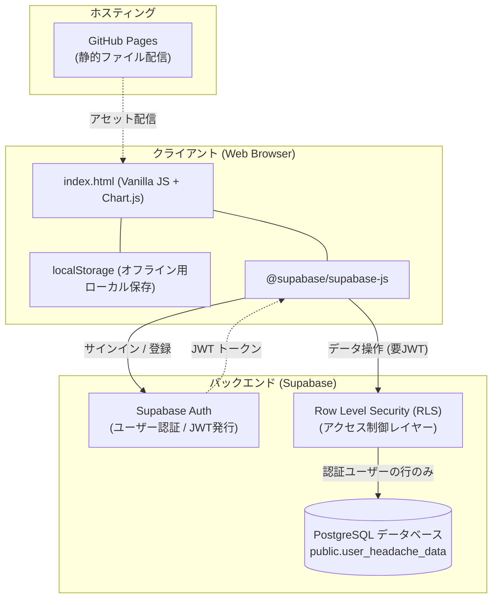

# システムアーキテクチャ・データベース設計書

本書では、頭痛記録アプリ（頭痛ろぐ）のシステム構成、データベーススキーマ、およびセキュリティ（RLS）設計について解説します。

---

## 1. システムアーキテクチャ

本アプリケーションは、GitHub Pages による静的ホスティングと、Supabase（BaaS）による認証・データベース連携を組み合わせたサーバーレス構成を採用しています。

SupabaseのProject URLとAPI Keyを設定すると、プロジェクト内にユーザーアカウントを新規登録できます。ユーザアカウント毎に記録を保存できます。認証はSupabase Authが担当し、認証済みユーザーのIDを `public.user_headache_data.user_id` に紐づけて、ユーザー単位で記録とタグを保存します。接続先設定がない場合は、認証を使わずブラウザの `localStorage` のみで利用できます。`localStorage` はサイト（オリジン）・ブラウザ・端末ごとに分離され、閲覧履歴の削除だけでは通常消えませんが、CookieやWebサイトデータ、サイトデータそのもの、ブラウザプロファイルを削除すると記録が失われる場合があります。

### コンポーネント構成
* **フロントエンド (Client)**: `index.html`（HTML5 / CSS3 / Vanilla JavaScript / Chart.js）
* **ホスティング (Hosting)**: GitHub Pages（静的アセット配信）
* **バックエンド (BaaS)**: Supabase
  * **認証 (Auth)**: Supabase Auth（メール/パスワード認証、JWTセッション管理）
  * **データベース (Database)**: PostgreSQL
  * **データアクセス (Data API)**: PostgREST（`@supabase/supabase-js` を利用したREST通信）
  * **アクセス制御 (RLS)**: Row Level Security による行単位のアクセス制御
* **ローカルキャッシュ (Cache)**: ブラウザの `localStorage`（未ログイン時およびオフライン時のデータ永続化）

### 画面構成と主な操作
* **記録する**: カレンダーで日付を選び、日時・症状・服薬・メモを登録する。既存の日時を選ぶと記録の編集・削除ができる。
* **記録を見る**: 集計期間を本日・直近7日・直近30日・全期間、または任意の日付範囲から選択する。1日以内は時間単位、60日以内は日単位、それより長い期間は週単位で集計する。症状は平均状態・日毎の回数・累計の回数、服薬は日毎・累計の回数を切り替えられ、記録一覧は日付・時刻の昇順／降順を切り替えられる。
* **設定**: タグの表示・並び替え、ライト／ダークテーマ、Supabase接続とアカウント設定、サンプルデータ追加を行う。

すべての操作ボタンは原則44px以上の高さを確保し、タッチ操作を前提とする。テーマ設定は `localStorage` に保存され、明示的な設定がない場合はOSのカラースキームに追従する。

統計画面の状態・日毎の回数はタグ別ヒートマップとして表示し、累計はタグ別の折れ線グラフとして表示する。ヒートマップのセルを選択すると、そのタグと期間の値を一時的なツールチップで確認できる。

### システムフロー図



---

## 2. データベース設計

### テーブル定義: `public.user_headache_data`

将来的なスキーマ変更に対する柔軟性と、フロントエンド側データ構造との親和性を考慮し、記録データおよびタグ設定は **JSONB型** を採用してユーザー単位の1レコードに集約管理しています。

| カラム名 | データ型 | 制約 | 説明 |
| :--- | :--- | :--- | :--- |
| `user_id` | `uuid` | `PRIMARY KEY, REFERENCES auth.users(id) ON DELETE CASCADE` | ユーザー一意識別子 (Supabase Authと連動) |
| `entries` | `jsonb` | `NOT NULL DEFAULT '[]'::jsonb` | 頭痛記録オブジェクトの配列 |
| `tags` | `jsonb` | `NOT NULL DEFAULT '{"symptom":[], "med":[], "memo":[]}'::jsonb` | カスタムタグ定義（症状・服薬・メモ） |
| `updated_at` | `timestamptz` | `NOT NULL DEFAULT now()` | レコード最終更新日時 |

### `entries` カラムのJSONスキーマ定義

各記録（1エントリー）は以下のプロパティを持つJSONオブジェクトとして保存されます。

```json
[
  {
    "id": "m1abc23xyz",
    "date": "2026-09-19",
    "time": "14:30",
    "symptoms": [
      { "tag": "偏頭痛", "severity": 3 }
    ],
    "meds": ["ロキソニン"],
    "memo": "天候悪化のため",
    "memoTags": ["気圧"],
    "createdAt": 1726720200000
  }
]
```

### `tags` カラムのJSONスキーマ定義

タグは症状（`symptom`）、服薬（`med`）、メモ（`memo`）の3種類で管理する。各タグは表示順を配列順で保持し、`hidden` が `true` のタグは記録入力画面の候補から非表示にする。

```json
{
  "symptom": [{ "name": "偏頭痛", "hidden": false }],
  "med": [{ "name": "ロキソニン", "hidden": false }],
  "memo": [{ "name": "気圧", "hidden": false }]
}
```

---

## 3. セキュリティ設計 (Row Level Security: RLS)

クライアントからデータベースへ直接クエリを発行する構成のため、PostgreSQLの **Row Level Security (RLS)** を必須としています。認証トークン（JWT）に含まれる `auth.uid()` を検証し、他ユーザーのデータへのアクセスをデータベースエンジン側で厳格に遮断します。

### ポリシー一覧

* **SELECT ポリシー**
  ```sql
  create policy "Users can select their own data"
    on public.user_headache_data for select
    using (auth.uid() = user_id);
  ```
* **INSERT ポリシー**
  ```sql
  create policy "Users can insert their own data"
    on public.user_headache_data for insert
    with check (auth.uid() = user_id);
  ```
* **UPDATE ポリシー**
  ```sql
  create policy "Users can update their own data"
    on public.user_headache_data for update
    using (auth.uid() = user_id);
  ```
